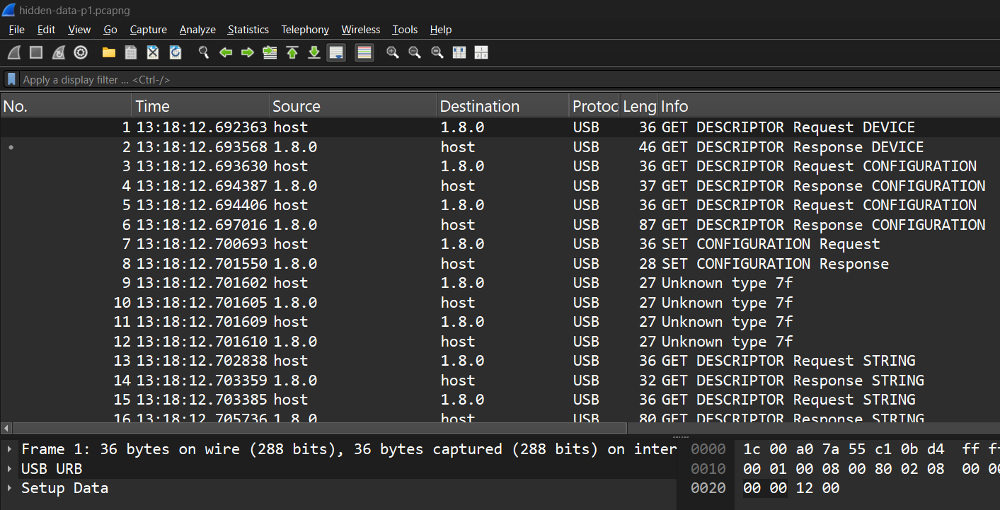
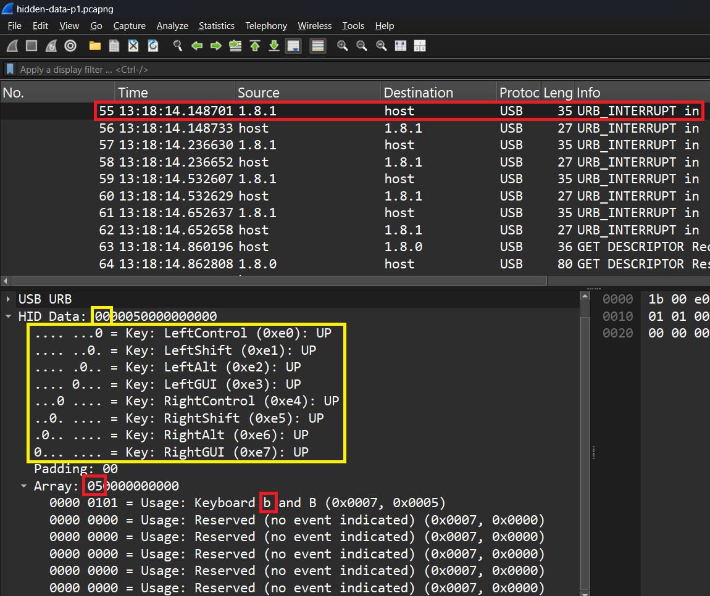

# Writeup for hidden-data-p1

# Open in Wireshark
First, it is important to figure out what you are working with. Open the file `hidden-data-p1.pcapng` in Wireshark.
Wireshark is a helpful tool that can be used to analyze USB and Network traffic. We know to use Wireshark because the filetype
is ".pcapng", which is a file supported by Wireshark.


*Figure 1: Wireshark with pcapng file open.*

Figure 1 shows the file `hidden-data-p1.pcapng` opened in Wireshark. Most of the first 50ish packets are used to setup and
configure the device. We know this because most of these packets say "GET DESCRIPTOR" in the `info` column. HID keyboard data
can be found in packets where the `info` column says "USB_INTERRUPT in".


*Figure 2: Wireshark with pcapng file open.*

Figure 2 has packet 55 selected in Wireshark. The info column shows that this is an "USB_INTERRUPT in",
meaning that the keyboard is interrupting the computer to send keyboard information. `05` is highlighted
within "Array". To convert this value to a character, consult page 53 of
https://www.usb.org/sites/default/files/documents/hut1_12v2.pdf. Search for the `05` in the "Usage ID (Hex)" column.
You will see that the character is "b" or "B". The capital or lowercase is determined by if the shift or caps lock key
was pressed when the button was pressed. To know if shift or caps lock was, refer to the yellow box in Figure 2 or page 59 of
the usb.org document. The `00` in the small yellow box is the value expanded in the large yellow box. Each of the 8 bits in the
byte `00` correspond to the special keys: LeftControl, LeftShift, LeftAlt, LeftGUI, RightControl, RightShift, RightAlt, or RightGUI.
If either of the shift keys are held down, then the character from the array is considered capital. If not, the letter is considered
lowercase. In this example, neither shift is held down, so we know the character is lowercase "b".

# TShark
Now that we can manually identify the HID data from the ".pcapng" file, its time to automate the process. But before we can automate,
we need to extract this HID data to a text file, for easy readability and automation. "TShark" is a utility that comes built into Wireshark,
and can be used with Wireshark filters to extract data from a capture file. Figure 2 shows that all data being sent as "USB_INTERRUPT in"
is coming from the source `1.8.1`, and thus we can prepare a filter on that source address. Next, the data we are interested in is the
USB HID data, thus we can extract only the `usbhid.data` fields.

```PowerShell
.\tshark.exe -r hidden-data-p1.pcapng -Y "usb.src == 1.8.1" -T "fields" -e usbhid.data > hidden-data-p1.txt
```
*Figure 3: TShark command used to extract HID data to text file.*

Running the command in Figure 3 will extract the HID data and save it to a text file. The `-r` flag specifies the file, in this case
`hidden-data-p1.pcapng`. The `-Y` flag specifies filters, in this case its packets with source `1.8.1`. The `-T` flag specifies the type of data to extract,
in this case we are extracting from `fields`. The `-e` flag specifies what fields to extract from, in this case `usbhid.data`. Finally, `>` means to
save output of the command to a file, in this case `hidden-data-p1.txt`.

```
0000000000000000
0000050000000000
0000000000000000
00001c0000000000
0000000000000000
0000180000000000
0000000000000000
0000060000000000
0000000000000000
0000170000000000
0000000000000000
0000090000000000
0000000000000000
0200000000000000
02002f0000000000
0200000000000000
0000000000000000
0000180000000000
0000000000000000
0000160000000000
0000000000000000
0000050000000000
0000000000000000
0200000000000000
02002d0000000000
0200000000000000
0000000000000000
0000070000000000
0000000000000000
0000210000000000
0000000000000000
0000170000000000
0000000000000000
0000210000000000
0000000000000000
0200000000000000
02002d0000000000
0200000000000000
0000000000000000
00001e0000000000
0000000000000000
0000160000000000
0000000000000000
0200000000000000
02002d0000000000
0200000000000000
0000000000000000
0000160000000000
0000000000000000
0000270000000000
0000000000000000
0200000000000000
02002d0000000000
0200000000000000
0000000000000000
0000060000000000
0000000000000000
0000270000000000
0000000000000000
0000270000000000
0000000000000000
00000f0000000000
0000000000000000
0200000000000000
0200300000000000
0200000000000000
0000000000000000
```
*Figure 4: Output file from TShark command.*

Running the TShark command from Figure 3 generates the text file shown in Figure 4. This information is the HID data
from every packet with source `1.8.1`. With this text file, we can now automate the conversion process.

# Automate
 It would take too long
and be erreroneous to do this process by hand. We created 


## Fix encoding
Convert from UTF-16 to UTF-8

## Run Python script
### Program Output
```
Decoded ASCII output: byuctf{usb_d4t4_1s_s0_c00l}
```