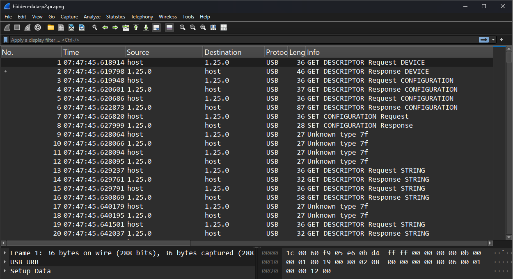
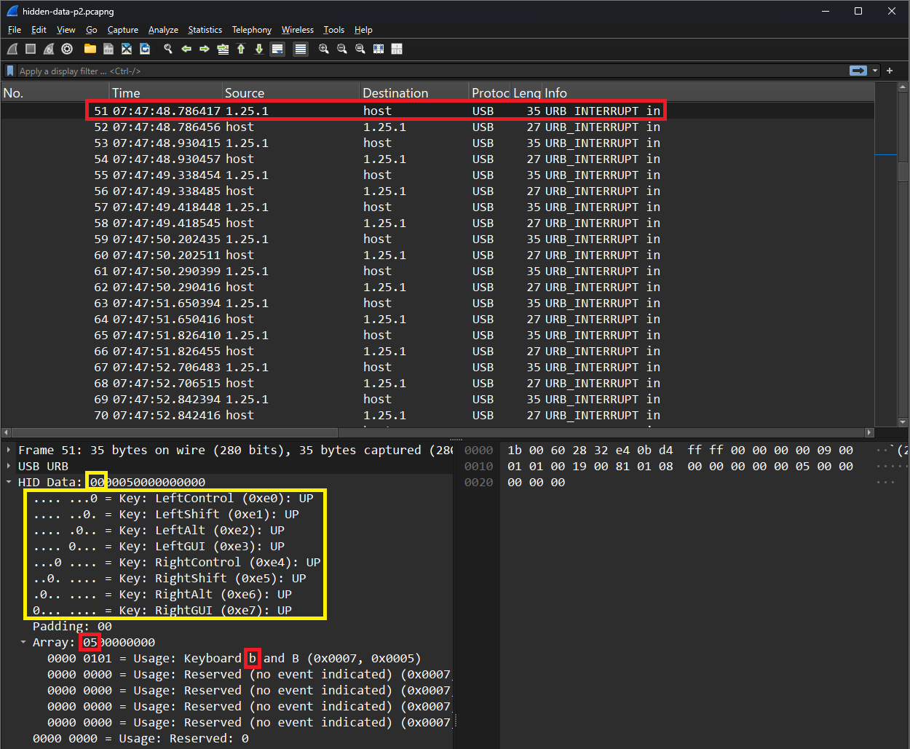
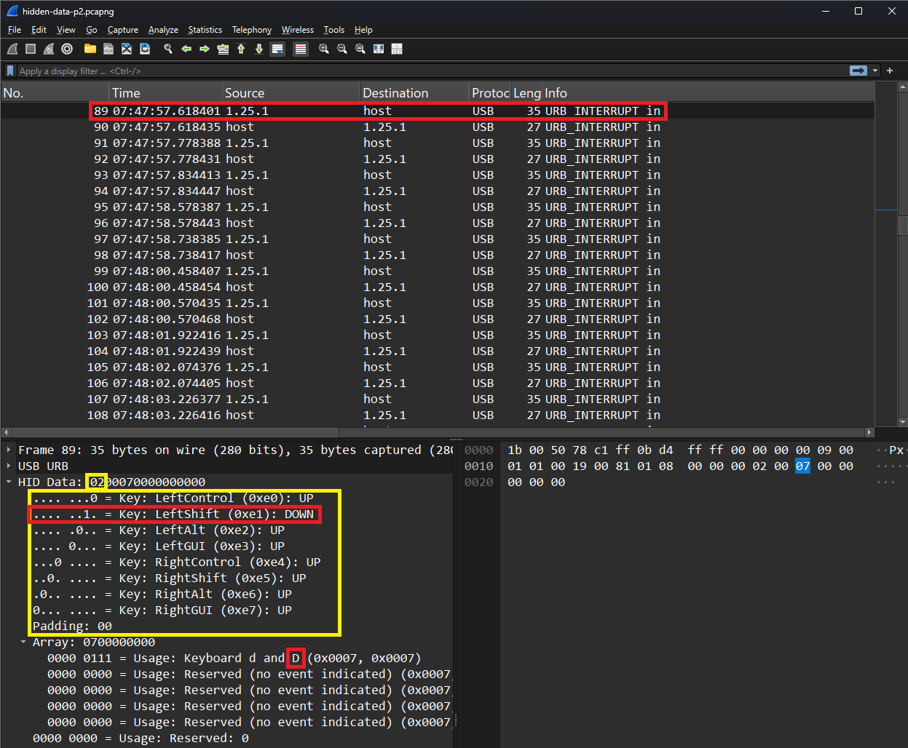
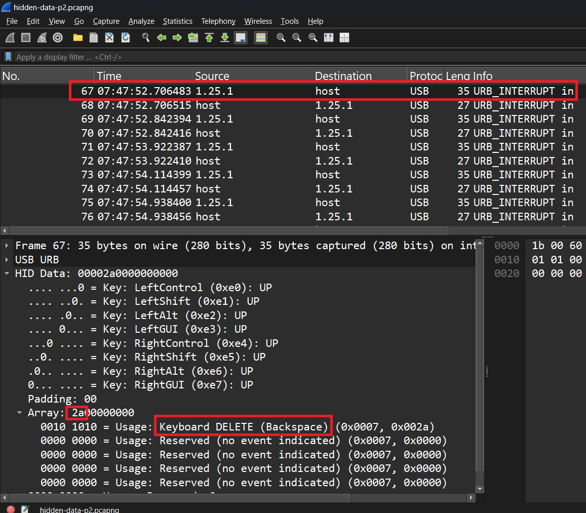

# Writeup for Hidden Data Part 2

## Introduction
HID (Human Interface Device) use generic USB drivers to enable communication between peripheral devices and a computer.
The HID data format is an industry standard for this communication. Common HID devices include keyboard, mice,
game controllers. While the length and formatting of HID data is standardized, the usage varies by device.
This CTF challenge involves HID data sent from a keyboard to a computer. Your objective is to find the hidden "flag"
within the HID data.


## Open in Wireshark
First, it is important to figure out what you are working with. Open the file `hidden-data-p2.pcapng` in Wireshark.
Wireshark is a helpful tool that can be used to analyze USB and Network traffic. We know to use Wireshark because the filetype
is ".pcapng", which is a file supported by Wireshark.


*Figure 1: Wireshark with pcapng file open.*

Figure 1 shows the file `hidden-data-p2.pcapng` opened in Wireshark. Most of the first 50ish packets are used to setup and
configure the device. We know this because most of these packets say "GET DESCRIPTOR" in the `info` column. HID keyboard data
can be found in packets where the `info` column says "USB_INTERRUPT in".


*Figure 2: Wireshark with pcapng file open.*

Figure 2 has packet 55 selected in Wireshark. The info column shows that this is an "USB_INTERRUPT in",
meaning that the keyboard is interrupting the computer to send keyboard information. `05` is highlighted
within "Array". To convert this value to a character, consult page 53 of
https://www.usb.org/sites/default/files/documents/hut1_12v2.pdf. Search for the `05` in the "Usage ID (Hex)" column.
You will see that the character is "b" or "B". The capital or lowercase is determined by if the shift or caps lock key
was pressed when the button was pressed. To know if shift or caps lock was, refer to the yellow box in Figure 2 or page 59 of
the usb.org document. The `00` in the small yellow box is the value expanded in the large yellow box. Each of the 8 bits in the
byte `00` correspond to the special keys: LeftControl, LeftShift, LeftAlt, LeftGUI, RightControl, RightShift, RightAlt, or RightGUI.
If either of the shift keys are held down, then the character from the array is considered capital. If not, the letter is considered
lowercase. In this example, neither shift is held down, so we know the character is lowercase "b".

This challenge has some backspace characters, which are used to delete letters in the string.
To get the accurate flag, you must account for the backspace characters while solving this
challenge. Page 54 of the document referenced previously states that backspace is `2A`.
Keep this in mind for the solve script later.


*Figure 3: Wireshark showing packet 89 with capital "D" character.*

Figure 3 shows the contents of packet 89 from this capture. The small yellow box highlights the value `02`, which is the hex value for the special characters pressed during the keystroke. The large yellow box shows which special characters were pressed during the keystroke. The red box within the large yellow box shows that the left shift key was pressed during the keystroke. This means that the letter should be replaced with the capital/alternate version of the character. The small red box at the bottom shows that the character pressed was "D". Because the shift key was held down, the letter is a capital "D" rather than a lowercase "d".


*Figure 4: Wireshark showing packet 67 with a backspace character.*

Figure 4 shows the details of packet 67. The small red box shows that the HID character value is `2a`. This value corresponds to the backspace character. The red box at the bottom of the screen confirms this, and shows that the character was "Keyboard DELETE (backspace)".


## TShark
Now that we can manually identify the HID data from the ".pcapng" file, its time to automate the process. But before we can automate,
we need to extract this HID data to a text file, for easy readability and automation. "TShark" is a utility that comes built into Wireshark,
and can be used with Wireshark filters to extract data from a capture file. Figure 2 shows that all data being sent as "USB_INTERRUPT in"
is coming from the source `1.25.1`, and thus we can prepare a filter on that source address.

```PowerShell
.\tshark.exe -r hidden-data-p2.pcapng -Y "usb.src == 1.25.1" -T "fields" -e usbhid.data > hidden-data-p2.txt
```
*Figure 5: TShark command used to extract HID data to text file.*

Running the command in Figure 5 will extract the HID data and save it to a text file.
* The `-r` flag specifies the file, in this case `hidden-data-p2.pcapng`.
* The `-Y` flag specifies filters, in this case its packets with source `1.25.1`.
* The `-T` flag specifies the type of data to extract, in this case we are extracting from `fields`.
* The `-e` flag specifies what fields to extract from, in this case `usbhid.data`.
* Finally, `>` means to save output of the command to a file, in this case `hidden-data-p2.txt`.

```
0000050000000000
0000000000000000
00001c0000000000
0000000000000000
0000180000000000
0000000000000000
00001d0000000000
0000000000000000
00002a0000000000
0000000000000000
0000060000000000
0000000000000000
0000170000000000
0000000000000000
0000090000000000
0000000000000000
0200000000000000
02002f0000000000
0200000000000000
0200070000000000
0200000000000000
0000000000000000
0000270000000000
0000000000000000
0000110000000000
0000000000000000
00001a0000000000
0000000000000000
00002a0000000000
0000000000000000
0000170000000000
0000000000000000
0200000000000000
02002d0000000000
0200000000000000
0200090000000000
0200000000000000
0000000000000000
0000270000000000
0000000000000000
0000150000000000
0000000000000000
0000150000000000
0000000000000000
00002a0000000000
0000000000000000
00000a0000000000
0000000000000000
0000200000000000
0000000000000000
0000170000000000
0000000000000000
0200000000000000
02002d0000000000
0200000000000000
0000000000000000
0000050000000000
0000000000000000
00002a0000000000
0000000000000000
0200000000000000
0200050000000000
0200000000000000
0000000000000000
0000210000000000
0000000000000000
0000060000000000
0000000000000000
00000e0000000000
0000000000000000
00000f0000000000
0000000000000000
00002a0000000000
0000000000000000
0000160000000000
0000000000000000
0000130000000000
0000000000000000
0000210000000000
0000000000000000
00001b0000000000
0000000000000000
00002a0000000000
0000000000000000
0000060000000000
0000000000000000
0000200000000000
0000000000000000
0000160000000000
0000000000000000
0200000000000000
0200300000000000
0200000000000000
0000000000000000
```
*Figure 6: Output file from TShark command.*

Running the TShark command from Figure 5 generates the text file shown in Figure 6. This information is the HID data
from every packet with source `1.25.1`. With this text file, we can now automate the conversion process.

Warning: Make sure the file is saved in "UTF-8" encoding, and not "UTF-16". Sometimes TShark will save the encoding
as UTF-16, which causes issues with the Python script in the next section.


## Automate
It would take too long and be erroneous convert the HID data by hand. To simplify, we recommend using Python to convert
the data.

```Python
hidKeyToAscii = {
    0x04: 'a', 0x05: 'b', 0x06: 'c', 0x07: 'd', 0x08: 'e', 0x09: 'f', 0x0A: 'g', 0x0B: 'h', 0x0C: 'i', 0x0D: 'j', 0x0E: 'k', 0x0F: 'l',
    0x10: 'm', 0x11: 'n', 0x12: 'o', 0x13: 'p', 0x14: 'q', 0x15: 'r', 0x16: 's', 0x17: 't', 0x18: 'u', 0x19: 'v', 0x1A: 'w', 0x1B: 'x',
    0x1C: 'y', 0x1D: 'z', 0x27: '0', 0x1E: '1', 0x1F: '2', 0x20: '3', 0x21: '4', 0x22: '5', 0x23: '6', 0x24: '7', 0x25: '8', 0x26: '9',
    0x2C: ' ', 0x2A: 'backspace', 0x28: 'enter', 0x2B: '\t', 0x2D: '_', 0x2F: '[', 0x30: ']', 0x33: ';', 0x34: "'", 0x36: ',', 0x37: '.', 0x38: '/',
    0x39: '[caps_lock]', 0x4F: '[right_arrow]', 0x50: '[left_arrow]', 0x51: '[down_arrow]', 0x52: '[up_arrow]'
}

hidShiftMap = {
    'a': 'A', 'b': 'B', 'c': 'C', 'd': 'D', 'e': 'E', 'f': 'F', 'g': 'G', 'h': 'H', 'i': 'I', 'j': 'J', 'k': 'K', 'l': 'L',
    'm': 'M', 'n': 'N', 'o': 'O', 'p': 'P', 'q': 'Q', 'r': 'R', 's': 'S', 't': 'T', 'u': 'U', 'v': 'V', 'w': 'W', 'x': 'X',
    'y': 'Y', 'z': 'Z', '1': '!', '2': '@', '3': '#', '4': '$', '5': '%', '6': '^', '7': '&', '8': '*', '9': '(', '0': ')',
    '[': '{', ']': '}', ';': ':', "'": '"', ',': '<', '.': '>', '/': '?'
}

def ParseHidReports(hidReports):
    result = []
    for report in hidReports:

        bytesArray = [int(report[i:i+2], 16) for i in range(0, len(report), 2)]

        shiftPressed = (bytesArray[0] & 0x02) > 0
        
        for keyCode in bytesArray[2:]:
            if keyCode == 0:
                continue 
            
            if keyCode in hidKeyToAscii:
                char = hidKeyToAscii[keyCode]
                
                if shiftPressed and char in hidShiftMap:
                    char = hidShiftMap[char]
                    
                if char == 'backspace' and result:
                    result.pop()
                elif char == 'enter' and result:
                    result.append("\n")
                else:
                    result.append(char)

    return ''.join(result)

def ReadHidReportsFromFile(filePath):
    with open(filePath, 'r') as file:
        hidReports = [line.strip() for line in file.readlines() if line.strip()]
    return hidReports

inputFilePath = './hidden-data-p2.txt' 

hidReports = ReadHidReportsFromFile(inputFilePath)

asciiOutput = ParseHidReports(hidReports)
print("Decoded ASCII output:", asciiOutput)
```
*Figure 7: Python script for decoding keyboard HID data.*

Figure 7 contains the Python script that can be used to convert the HID data to characters. The conversion
table has also been transcribed into the script. The Python script reads in the HID data from the file specified
in `inputFilePath`. The script gets each HID value, and converts it to its corresponding character in `hidKeyToAscii`.
If shift was held for a character, then the character is converted to the shift value using `hidShiftMap`.

To address the backspace characters, the code has been modified. The line with `char == 'backspace'` checks to see if the character was a backspace. If the character was, the previous character is removed from the string. This ensures the correct flag is produced at the end.

```
Decoded ASCII output: byuctf{D0nt_F0rg3t_B4cksp4c3s}
```
*Figure 8: Result of running Python script.*

Running the Python script provides the result seen in Figure 8. Congratulations, you have solved the challenge!
The flag/answer to this challenge is `byuctf{D0nt_F0rg3t_B4cksp4c3s}`.