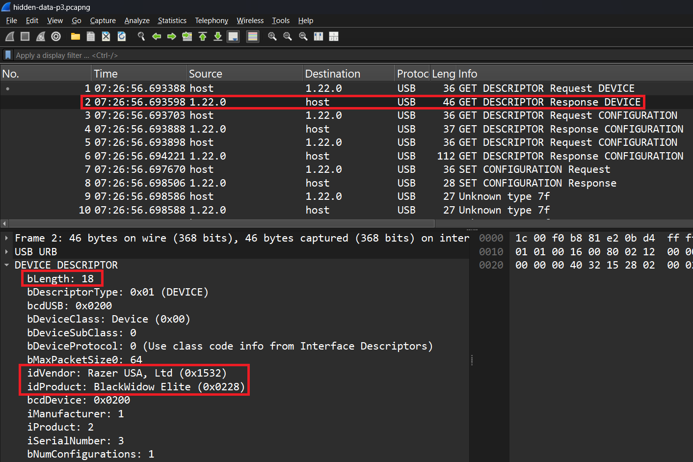
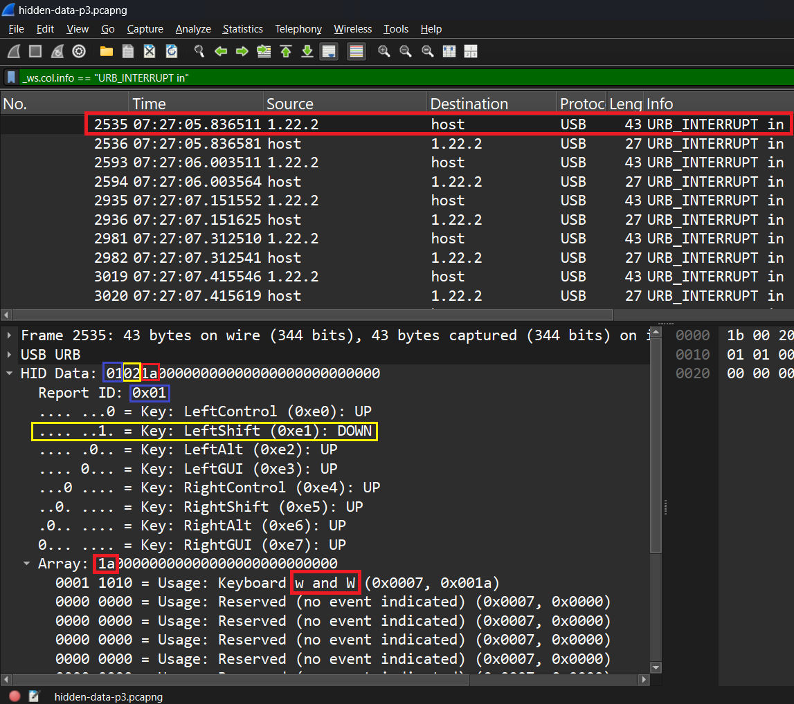

# Writeup for Hidden Data Part 3

## Introduction
HID (Human Interface Device) use generic USB drivers to enable communication between peripheral devices and a computer. The HID data format is an industry standard for this communication. Common HID devices include keyboard, mice, game controllers. While the length and formatting of HID data is standardized, the usage varies by device. This CTF challenge involves HID data sent from a keyboard to a computer. Your objective is to find the hidden "flag" within the HID data. This challenge uses the extended version of the HID data format.


## Open in Wireshark
First, it is important to figure out what you are working with. Open the file `hidden-data-p3.pcapng` in Wireshark. Wireshark is a helpful tool that can be used to analyze USB and Network traffic. We know to use Wireshark because the filetype is ".pcapng", which is a file supported by Wireshark.


*Figure 1: Wireshark showing device information in Packet 2.*

Figure 1 shows the device information for this keyboard. The bLength is `18`, specifying that this device will use the extended HID data standard, allowing the device to use 16 bytes for HID data rather than the regular 8 bytes.

Figure 1 also shows the vendor and product names of the keyboard. `idVendor` specifies that the keyboard is built by "Razer". `idProduct` specifies that the keyboard model/product is "BlackWidow Elite".


*Figure 2: Wireshark showing information for packet 2535.*

Figure 2 shows HID data information transmitted in packet 2535. The blue squares highlight the value `01` at the start of the HID data. Because this keyboard is using an extended standard of HID, the first byte is used for "Report ID", something utilized by the keyboard for advanced features. The next byte in the HID data is squared in yellow. This byte specifies special characters pressed during the keystroke. In this case, the left shift key was pressed, as shown in the large yellow square. Finally, the red squares highlight the third piece of data in the HID data, with the value `1a`. As shown in the red rectangle near the bottom, the character is either "w" or "W". Because the left shift key was pressed, we know that the character is an uppercase "W".

Most of the packets with HID keyboard data were sent by source `1.22.2`. For unknown reasons, a few packets with HID keyboard data were also sent using source `1.22.1`.


## TShark
Now that we can manually identify the HID data from the ".pcapng" file, its time to automate the process. But before we can automate, we need to extract this HID data to a text file, for easy readability and automation. "TShark" is a utility that comes built into Wireshark, and can be used with Wireshark filters to extract data from a capture file. Figure 2 shows that all data being sent as "USB_INTERRUPT in" is coming from sources `1.22.1` and `1.22.2`. We can use this information to filter and extract the data.

```PowerShell
.\tshark.exe -r hidden-data-p3.pcapng -Y "usb.src == 1.22.1 || usb.src == 1.22.2" -T "fields" -e usbhid.data > hidden-data-p3.txt
```
*Figure 3: TShark command used to extract HID data to text file.*

Running the command in Figure 3 will extract the HID data and save it to a text file.
* The `-r` flag specifies the file, in this case `hidden-data-p3.pcapng`.
* The `-Y` flag specifies filters, in this case its packets with source `1.22.1` or `1.22.2`.
* The `-T` flag specifies the type of data to extract, in this case we are extracting from `fields`.
* The `-e` flag specifies what fields to extract from, in this case `usbhid.data`.
* Finally, `>` means to save output of the command to a file, in this case `hidden-data-p3.txt`.

```
0000050000000000
0000000000000000
01001c00000000000000000000000000
01000000000000000000000000000000
01001800000000000000000000000000
01000000000000000000000000000000
01000600000000000000000000000000
01000000000000000000000000000000
01001700000000000000000000000000
01000000000000000000000000000000
01000900000000000000000000000000
01000000000000000000000000000000
01020000000000000000000000000000
01022f00000000000000000000000000
01020000000000000000000000000000
01021a00000000000000000000000000
01020000000000000000000000000000
01000000000000000000000000000000
01000b00000000000000000000000000
01000000000000000000000000000000
01002100000000000000000000000000
01000000000000000000000000000000
01001700000000000000000000000000
01000000000000000000000000000000
01020000000000000000000000000000
01022d00000000000000000000000000
01020000000000000000000000000000
01000000000000000000000000000000
01002100000000000000000000000000
01000000000000000000000000000000
01020000000000000000000000000000
01022d00000000000000000000000000
01020000000000000000000000000000
01021a00000000000000000000000000
01000000000000000000000000000000
01002000000000000000000000000000
01000000000000000000000000000000
01001e00000000000000000000000000
01000000000000000000000000000000
01001500000000000000000000000000
01000000000000000000000000000000
01000700000000000000000000000000
01000000000000000000000000000000
01020000000000000000000000000000
01022d00000000000000000000000000
01020000000000000000000000000000
01021800000000000000000000000000
01020000000000000000000000000000
01021600000000000000000000000000
01020000000000000000000000000000
01020500000000000000000000000000
01020000000000000000000000000000
01023000000000000000000000000000
01020000000000000000000000000000
01000000000000000000000000000000
```
*Figure 4: Output file from TShark command.*

Running the TShark command from Figure 3 generates the text file shown in Figure 4. This information is the HID data from every packet with source `1.22.1` or `1.22.2`. With this text file, we can now automate the conversion process.

Warning: Make sure the file is saved in "UTF-8" encoding, and not "UTF-16". Sometimes TShark will save the encoding as UTF-16, which causes issues with the Python script in the next section.


## Automate
It would take too long and be erroneous convert the HID data by hand. To simplify, we recommend using Python to convert the data.

```Python
hidKeyToAscii = {
    0x04: 'a', 0x05: 'b', 0x06: 'c', 0x07: 'd', 0x08: 'e', 0x09: 'f', 0x0A: 'g', 0x0B: 'h', 0x0C: 'i', 0x0D: 'j', 0x0E: 'k', 0x0F: 'l',
    0x10: 'm', 0x11: 'n', 0x12: 'o', 0x13: 'p', 0x14: 'q', 0x15: 'r', 0x16: 's', 0x17: 't', 0x18: 'u', 0x19: 'v', 0x1A: 'w', 0x1B: 'x',
    0x1C: 'y', 0x1D: 'z', 0x27: '0', 0x1E: '1', 0x1F: '2', 0x20: '3', 0x21: '4', 0x22: '5', 0x23: '6', 0x24: '7', 0x25: '8', 0x26: '9',
    0x2C: ' ', 0x2A: 'backspace', 0x28: 'enter', 0x2B: '\t', 0x2D: '_', 0x2F: '[', 0x30: ']', 0x33: ';', 0x34: "'", 0x36: ',', 0x37: '.', 0x38: '/',
    0x39: '[caps_lock]', 0x4F: '[right_arrow]', 0x50: '[left_arrow]', 0x51: '[down_arrow]', 0x52: '[up_arrow]'
}

hidShiftMap = {
    'a': 'A', 'b': 'B', 'c': 'C', 'd': 'D', 'e': 'E', 'f': 'F', 'g': 'G', 'h': 'H', 'i': 'I', 'j': 'J', 'k': 'K', 'l': 'L',
    'm': 'M', 'n': 'N', 'o': 'O', 'p': 'P', 'q': 'Q', 'r': 'R', 's': 'S', 't': 'T', 'u': 'U', 'v': 'V', 'w': 'W', 'x': 'X',
    'y': 'Y', 'z': 'Z', '1': '!', '2': '@', '3': '#', '4': '$', '5': '%', '6': '^', '7': '&', '8': '*', '9': '(', '0': ')',
    '[': '{', ']': '}', ';': ':', "'": '"', ',': '<', '.': '>', '/': '?'
}

def ParseHidReports(hidReports):
    result = []
    for report in hidReports:

        bytesArray = [int(report[i:i+2], 16) for i in range(0, len(report), 2)]

        shiftPressed = (bytesArray[1] & 0x02) > 0
        
        for keyCode in bytesArray[2:]:
            if keyCode == 0:
                continue 
            
            if keyCode in hidKeyToAscii:
                char = hidKeyToAscii[keyCode]
                
                if shiftPressed and char in hidShiftMap:
                    char = hidShiftMap[char]
                    
                if char == 'backspace' and result:
                    result.pop()
                elif char == 'enter' and result:
                    result.append("\n")
                else:
                    result.append(char)

    return ''.join(result)

def ReadHidReportsFromFile(filePath):
    with open(filePath, 'r') as file:
        hidReports = [line.strip() for line in file.readlines() if line.strip()]
    return hidReports

inputFilePath = './hidden-data-p3.txt' 

hidReports = ReadHidReportsFromFile(inputFilePath)

asciiOutput = ParseHidReports(hidReports)
print("Decoded ASCII output:", asciiOutput)
```
*Figure 5: Python script for decoding keyboard HID data.*

Figure 5 contains the Python script that can be used to convert the HID data to characters. Page 53 of https://www.usb.org/sites/default/files/documents/hut1_12v2.pdf contains a conversion table for converting HID hexadecimal values to characters. This conversion table has been transcribed into this script. The Python script reads in the HID data from the file specified in `inputFilePath`. The script gets each HID value, and converts it to its corresponding character in `hidKeyToAscii`. If shift was held for a character, then the character is converted to the shift value using `hidShiftMap`.

```
Decoded ASCII output: byuctf{wh4t_4_w31rd_usb}
```
*Figure 6: Result of running Python script.*

Running the Python script provides the result seen in Figure 5. Congratulations, you have solved the challenge!
The flag/answer to this challenge is `byuctf{wh4t_4_w31rd_usb}`.