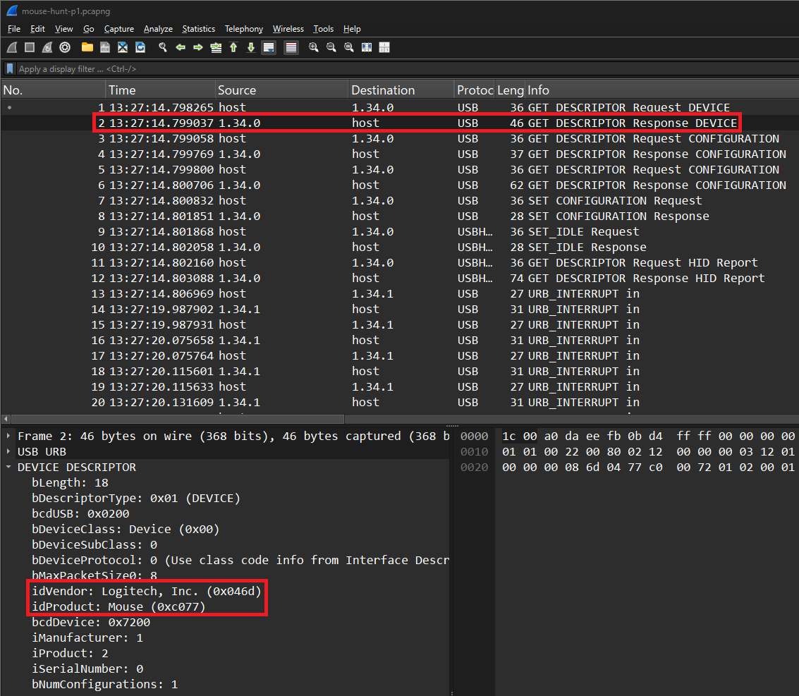
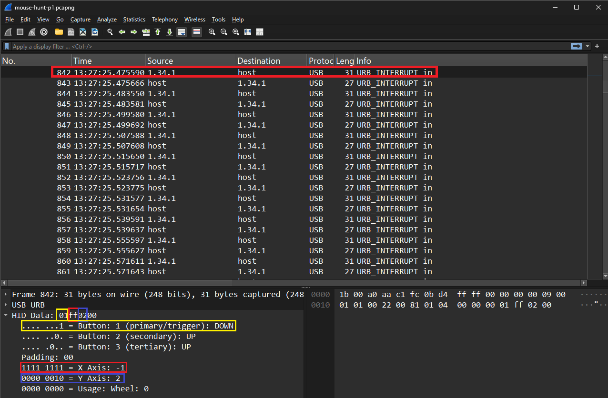
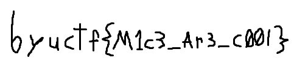

# Writeup for Hidden Data Part 3

## Introduction
HID (Human Interface Device) use generic USB drivers to enable communication between peripheral devices and a computer. The HID data format is an industry standard for this communication. Common HID devices include keyboard, mice, game controllers. While the length and formatting of HID data is standardized, the usage varies by device. This CTF challenge involves HID data sent from a mouse to a computer. Your objective is to find the hidden "flag" within the HID data. The flag was hand drawn in MS Paint using the mouse.


## Open in Wireshark
First, it is important to figure out what you are working with. Open the file `mouse-hunt-p1.pcapng` in Wireshark. Wireshark is a helpful tool that can be used to analyze USB and Network traffic. We know to use Wireshark because the filetype is ".pcapng", which is a file supported by Wireshark.


*Figure 1: Wireshark showing device information in Packet 2.*

Figure 1 shows the device information for this mouse. `idVendor` specifies that the mouse is built by "Logitech". `idProduct` specifies that the mouse model/product is "Mouse".


*Figure 2: Wireshark showing information in Packet 842.*

Figure 2 shows information from packet 842.
* The small yellow box shows the value `01` for the mouse portion of the HID data. As shown in the large yellow rectangle, this value corresponds to the left/primary/trigger button being pressed on the mouse. Since we know the flag was being drawn in MS paint, this likely means the mouse was drawing in this moment.
* The small red box shows the value `ff`. As shown in the red rectangle near the bottom, this value corresponds to the mouse moving `-1` units in the "X" direction. Simply put, the mouse is moving left by 1 unit.
* The small blue box shows the value `02`. As shown in the larger blue rectangle, this value corresponds to the mouse moving `2` units in the "Y" direction. Simply put, the mouse is moving up by 2 units.


## TShark
Now that we can manually identify the HID data from the ".pcapng" file, its time to automate the process. But before we can automate, we need to extract this HID data to a text file, for easy readability and automation. "TShark" is a utility that comes built into Wireshark, and can be used with Wireshark filters to extract data from a capture file. Figure 2 shows that all data being sent as "USB_INTERRUPT in" is coming the source `1.34.1`. We can use this information to filter and extract the data.

```PowerShell
.\tshark.exe -r mounse-hunt-p1.pcapng -Y "usb.src == 1.34.1" -T "fields" -e usbhid.data > mounse-hunt-p1.txt
```
*Figure 3: TShark command used to extract HID data to text file.*

Running the command in Figure 3 will extract the HID data and save it to a text file.
* The `-r` flag specifies the file, in this case `mounse-hunt-p1.pcapng`.
* The `-Y` flag specifies filters, in this case its packets with source `1.34.1`.
* The `-T` flag specifies the type of data to extract, in this case we are extracting from `fields`.
* The `-e` flag specifies what fields to extract from, in this case `usbhid.data`.
* Finally, `>` means to save output of the command to a file, in this case `mounse-hunt-p1.txt`.

```
01000000
01000100
01000100
01000100
01000200
01000100
01000100
01000300
01000100
01fe0300
01000200
01000200
01000300
01ff0300
01000300
01ff0300
01000200
01ff0300
01fe0300
01000200
01000200
01000400
01ff0200
01000300
01000200
01000300
01ff0100
01000300
01000100
01000100
01000300
01000100
01000100
01000200
01000200
01000200
01000200
01000100
01000100
01000100
01ff0100
01000200
01000100
01000100
01000200
01000200
01000300
01000200
01000100
01000300
01000100
01000100
01fe0200
01000100
01000100
01000100
01000200
01000100
01000100
01000100
01000300
01000100
01000100
01000300
...
```
*Figure 4: Output file from TShark command.*

Running the TShark command from Figure 3 generates the text file shown in Figure 4. This information is the HID data from every packet with source `1.34.1`. The full file has more than 4,000 lines, and cannot be shown fully in this writeup. With this text file, we can now automate the conversion and redrawing process.

Warning: Make sure the file is saved in "UTF-8" encoding, and not "UTF-16". Sometimes TShark will save the encoding as UTF-16, which causes issues with the Python script in the next section.


## Automate
It would take too long and be erroneous convert the HID data by hand. To simplify, we recommend using Python to convert the data.

```Python
from pynput.mouse import Controller, Button
import time

def ParseHidData(dataLine):
    """
    Parse a single line of HID data.
    Each line is assumed to be 6 hex bytes in little-endian format.
    """

    rawBytes = bytes.fromhex(dataLine)

    buttonState = rawBytes[0]
    
    # Parse x and y movement from the HID data
    x = rawBytes[1] if rawBytes[1] < 128 else rawBytes[1] - 256  # Handling signed values
    y = rawBytes[2] if rawBytes[2] < 128 else rawBytes[2] - 256  # Handling signed values
    
    return buttonState, x, y

def SimulateMouseMovements(hidData):
    """
    Simulate mouse movements and button presses from a list of HID data strings.
    """
    mouse = Controller()  # Initialize the mouse controller
    
    for dataLine in hidData:
        buttonState, x, y = ParseHidData(dataLine)
        
        mouse.move(x, y)  # Move the mouse by (x, y) instantly
        
        if buttonState == 1:  # Left button pressed
            mouse.press(Button.left)
        else:  # Left button released
            mouse.release(Button.left)
        time.sleep(0.01)


with open("captures/mouse-hunt-p1.txt", "r") as file:
    hidData = [line.strip() for line in file.readlines() if line.strip()]

time.sleep(5)

SimulateMouseMovements(hidData)
```
*Figure 5: Python script for decoding and recreating mouse movement from HID data.*

Figure 5 contains the Python code for recreating the mouse movement information. The HID data is read in, converted into mouse clicks, x movement, and y movement. Once the information is converted, the mouse on the computer running this script simulates the movement and clicks from the HID data.


*Figure 6: Result of running Python script.*

To recreate the mouse movement, open MS paint or similar drawing utility. Then select the pen or a drawing utility. Next, run the Python script, and hover the mouse over the top left of the drawing area. After a 2 second delay, the Python script will start simulating the mouse actions and movements from the HID data. The result of running this script in MS paint is shown in Figure 6.

Congratulations, you have solved the challenge!
The flag/answer to this challenge is `byuctf{M1c3_Ar3_C00l}`.